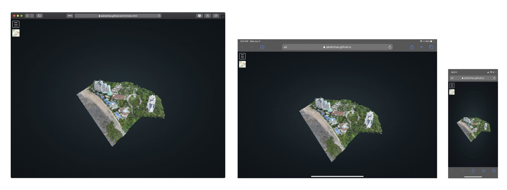

# Potree - A Possible Future for Point Cloud Visualization

**Author: Steven Bao**


### Introduction

[Potree](https://github.com/potree/potree/) is a free open-source web-based point cloud renderer, which was developed by Markus Schütz. It is a very efficient and convenient tool for rendering point clouds, especially large point clouds, in the web environment in real-time. And PotreeConverter is the tool for converting typical point cloud file formats, such as `.las` and `.xyz` into the format used by Potree. It could also generate a basic Potree webpage for the point clouds based on the provided template.


### Purpose of Potree

Point cloud data is typically large in size. Traditionally, if one wants to present point clouds as a 3D model to others, transferring large amounts of data and installing certain software beforehand would be necessary. At the same time, powerful computers are also usually required for rendering point clouds. The goal of Markus Schütz, the author of Potree, is to develop a tool that can render large point cloud datasets conveniently on most devices, ideally without pre-downloading large data or installing any third-party software. As Schütz has said in his master thesis:

> The easier it is to access, the greater the audience... one of the aims of this thesis is to maximize the audience by making the process [of viewing point clouds] as easy as visiting a web page.

As a result, Potree is developed based on WebGL to render point clouds in common web browsers.


### Author & Funding

Potree was started independently by Markus Schütz at the Vienna University of Technology. As for now, it is a collaborative project based on the [TU Wien Scanopy project](https://www.cg.tuwien.ac.at/research/projects/Scanopy/), [Harvest4D](https://harvest4d.org/), [GCD Doctoral College](https://gcd.tuwien.ac.at/), and [Superhumans](https://www.cg.tuwien.ac.at/research/projects/Superhumans/). The project is funded and sponsored by multiple agencies, including [EU 7th Framework Program 323567](https://ec.europa.eu/transport/themes/research/fp7_en), [TU Wien](https://www.tuwien.at/en/), [FWF](https://www.fwf.ac.at/), [ne.ch](http://www.ne.ch/autorites/DDTE/SGRF/SITN/Pages/accueil.aspx), [Synth Tech](http://www.synth3d.co/), [GeoCue](https://geocue.com), [rapidlasso GmbH](https://rapidlasso.com/), [Bay Area Rapid Transit](https://www.bart.gov/), [Georepublic](http://georepublic.info/), etc.


### Function

The primary function of Potree is a web-based viewer of point clouds. In addition to that, it is incorporated with a variety of tools for multiple purposes of point cloud visualization. Some of the essential functions listed in the [GitHub repository page](https://github.com/potree/potree/#examples) include:

- [Virtual Reality](http://potree.org/potree/examples/vr.html)
- [Geopackage integration](http://potree.org/potree/examples/geopackage.html)
- [Point Classifications](http://potree.org/potree/examples/classifications.html)
- [Measurements](http://potree.org/potree/examples/measurements.html)
- [Elevation Profile](http://potree.org/potree/examples/elevation_profile.html)
- [Annotations](http://potree.org/potree/examples/annotations.html)


### How It Works

For analyzing how Potree works as a web-based point cloud renderer, I'll be using [this website](https://jakobzhao.github.io/sfm/index.html), created by Dr. Bo Zhao and me using PotreeConverter, as an example.


Point clouds are usually composed of thousands, millions, and even billions of individual points. How to render the numerous points has always been a challenge for people who work with point cloud visualization. For Potree, according to Schütz, "a slightly adapted modifiable nested octree (MNO) structure" is used to store the points.

Here is a picture Schütz used in [his master thesis](https://www.researchgate.net/publication/309358171_Potree_Rendering_Large_Point_Clouds_in_Web_Browsers) to illustrate the structure:


By utilizing such a structure, when opening the Potree webpage, only a small amount of data (for example, the points in Level 0) is downloaded in order to render the basic outline/shape of the point cloud. As the user is browsing, more points are being downloaded from the server and loaded into the renderer. In such a way, users don't need to wait to view the point cloud until the whole dataset is downloaded. 

Here is a GIF showing how the data are downloaded for rendering the point cloud. Or you could open [this link](https://jakobzhao.github.io/sfm/index.html) in your browser and open the developer tool to see how data are being loaded.


We can observe that what we initially see in the render area is a roughly rendered point cloud. It is composed of relatively large points, which are in the lower levels of the potree data structure. As we stay longer in the webpage, more points are downloaded and rendered. Also, when we zoom in or change the view, more data are downloaded for rendering the area that we are looking at. Among those, we can also adjust the "Point Budget" in the sidebar toolkit to load either less or more points for the rendering of the point cloud. Therefore, rather than requiring every point to render a point cloud, Potree only needs the points that are "important" to boost its performance in point cloud rendering. By maximizing the utilization rate of the points and doing all of the work within a web browser, Potree has successfully achieved the goals that Schütz set.


### System Architecture

For Potree, the web clients are the users using web browsers to visit the Potree webpage. In terms of servers, besides merely serving as the web entry point, the web server is also acting as the geospatial web service server and the database server because that's where the point cloud datasets get rendered and stored.

The general file structure for a Potree webpage is as below:

```
[Potree Webpage]
    │index.html   --- the Potree webpage
    ├─libs        --- geospatial web service;
    │                 the folder that contains all the libraries used 
    │                 for rendering point clouds
    └─pointclouds --- database; the folder that stores the point cloud data
                   
```

### Major Libraries Used

- [three.js](https://github.com/mrdoob/three.js/) - The basic JavaScript WebGL 3D library for point clouds rendering
- [Plas.io (laslaz)](https://github.com/verma/plasio) - LAS and LAZ support for point cloud rendering
- [proj4js](https://github.com/proj4js/proj4js) - Coordinate system support for point cloud data
- [Cesium](https://github.com/CesiumGS/cesium) - Incorporate 3D point clouds into maps


### UI/UX Design

#### For Normal Users That Only Browse the Potree Webpages

The overall idea and implementation of Potree are extraordinary. As expected by the author Markus Schütz, it has effectively helped broaden the audience of point cloud visualization. One can use the web browser on either a computer or a mobile device to view well-rendered point clouds within seconds without installing any third-party software or pre-downloading large-size point cloud data.



However, while the interaction with the rendered point cloud is very intuitive, the tools in the sidebar are sometimes difficult for users to understand. For example, I have been taking a very long trying to figure out what these functions exactly do, and till today I am still not sure about some of the functions, such as the buttons below "Navigation." Also, for mobile device users, the camera position could not be changed. In other words, while using a mobile device, one can only zoom in or out at the initial position.


####  For Developers or Professionals That Use Potree to Present Point Clouds

The [PotreeConverter](https://github.com/potree/PotreeConverter/releases) that comes along with Potree is a handy tool for converting point cloud data in common formats, such as `.las`, `.laz`, and `.xyz` into the format used by Potree and creating a Potree webpage for the point clouds. Instructions on how to use PotreeConverter are also provided on the GitHub repository website. The Potree webpage is highly customizable, which means developers could do almost whatever they want to do in terms of UI and UX. The flexibility of it is highly appreciated when comparing with traditional point cloud viewers such as Cloud Compare or Metashape.

Although many tools and functionalities have been successfully incorporated into Potree, how to implement those functionalities in the basic webpage created by PotreeConverter is not an easy task. The documentation is very limited. While the functionalities in the [examples](https://github.com/potree/potree/#examples) offered by the author are achievable, developers might need to spend a lot of time learning about the codes, many of which are poorly commented. This could be a major difficulty for most of the developers to work with it.


### Social Implications of Potree

As said by the creator of Potree, one of the goals of Potree is to "maximize the audience." By achieving the goal, it helps bridge the digital divide in point cloud visualization, especially for people who only need to view the point cloud visualization. The web-based Potree has made point cloud visualization much more accessible than before. At the same time, the PotreeConverter also makes it easy for developers to visualize their point clouds in the web environment.

Moreover, because point cloud visualization is usually in the real 3-D form, it could provide a much more immersive experience than a traditional map or a panoramic map. With the support of Potree, point cloud visualization could be easily popularized as a new way to see our world. For example, a well-developed virtual campus tour based on Potree could definitely help new students to learn more about the campus, while they are confined within their home during this particular time, or while they live far away from the campus and cannot afford the transportation expenditure for a single campus tour. The 3D point clouds, which could be reached by simply clicking on a link, are able to offer an unparalleled experience when compared with looking at the campus in Google Street View.

However, what we must keep in mind is that Potree is only a tool for visualization. It could lead to biases or misinformation when wrong data are used either maliciously or unintentionally. In the world in which "fake" data are all around us, the immersive experience created by "fake" point cloud data might also distort our perception of reality.


### Summary

As a web-based point cloud viewer, Potree has an unparalleled advantage in its accessibility over other traditional software for point cloud visualization. The versatility of being web-based also provides Potree itself with many possible futures. While there are still some minor issues, it has the potential to be an iconic tool in the field of point cloud visualization.


### References

1. https://www.researchgate.net/publication/309358171_Potree_Rendering_Large_Point_Clouds_in_Web_Browsers
2. https://github.com/potree/potree/ 
